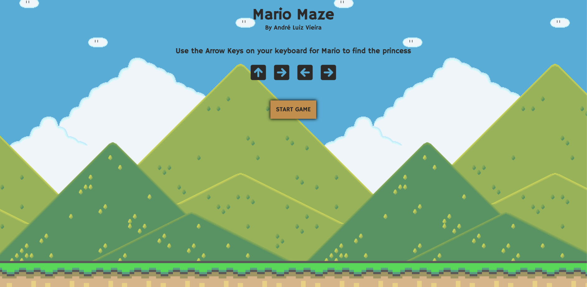

# Mario Maze Game Project

This is a Mario-themed maze game created to learn JavaScript and JavaScript events.

# Mario Maze Game Project

### Short Description

A simple Mario-themed maze game created to learn JavaScript and JavaScript events.

### Description

This project is a maze game featuring Mario. It was developed as a learning exercise to practice JavaScript programming and event handling. The game involves navigating Mario through a maze to reach the goal, avoiding obstacles and collecting items along the way.

### Features

- Navigate Mario through a maze.
- Collect items and avoid obstacles.
- Simple and intuitive gameplay.

### Technologies Used

- JavaScript
- HTML5
- CSS3

### Getting Started

To run the game locally:

1. Clone this repository.
2. Open `index.html` in your web browser.

### Screenshots

### License

This project is licensed under the MIT License. See the [LICENSE](./LICENSE) file for more details.
